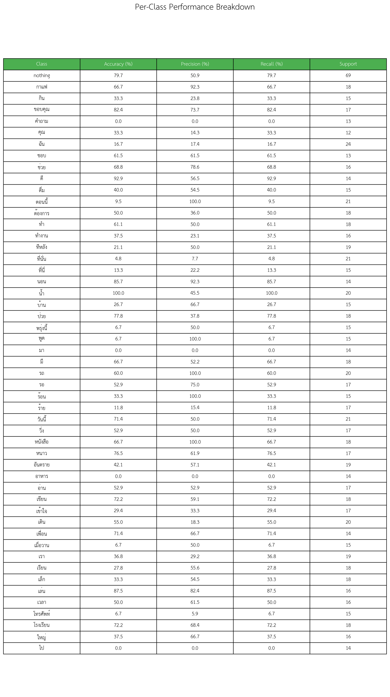
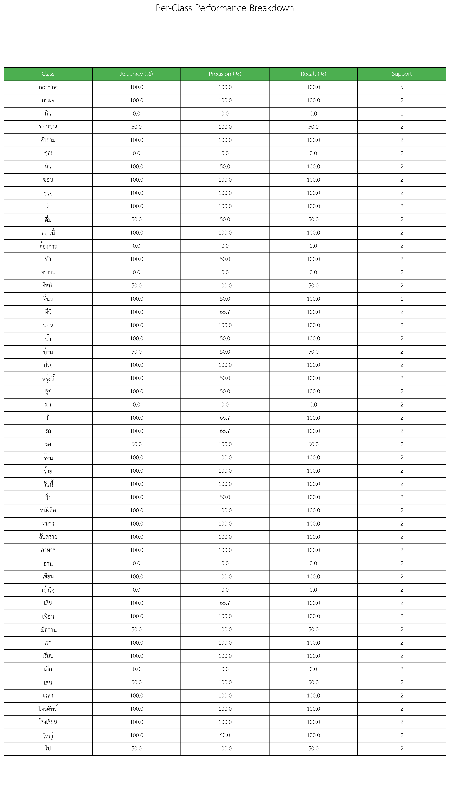

# Sign Language Detection - CNN Time Series Classifier

A deep learning project for classifying sign language gestures using time series sensor data with a Convolutional Neural Network (CNN) architecture.

## 🎯 Overview

This project implements a CNN-based time series classifier designed to recognize sign language gestures from sensor data. The system processes sequential sensor readings and classifies them into different gesture categories with high accuracy.

## 🏗️ Architecture
The CNN model follows this architecture:
- **Input**: Time series data with shape `(sequence_length, n_features)` (default: 50 × 28)
- **Normalization**: Batch normalization layer
- **Conv2D Layers**: Three convolutional blocks with ReLU activation and max pooling
- **Dense Layers**: Fully connected layers with dropout for classification
- **Output**: Multi-class classification probabilities

### Model Structure
```
Input (50, 28) → BatchNorm → Conv2D(32) → MaxPool → Conv2D(64) → MaxPool → Conv2D(64) → Flatten → Dense(64) → Dense(n_classes)
```

## 📋 Requirements

```
torch (match your cuda version)
torchvision
numpy
pandas
scikit-learn
matplotlib
seaborn
tqdm
scipy
```

## 📁 Project Structure

```
├── model.py                 # Core CNN model and training utilities
├── train.py                 # Training script
├── src/                     # Source code directory
├── saved_models/           # Trained model checkpoints
├── evaluation_results/     # Model evaluation outputs
├── label.json             # Label mappings
├── rollback.json          
└── README.md              
```

## 🚀 Quick Start

### 1. Data Preparation

Ensure your data is in CSV format with the following structure:
- Time series features (sensor readings)
  {timestamp_ms,ax_slav,ay_slav,az_slav,gx_slav,gy_slav,gz_slav,angle_x_slav,angle_y_slav,angle_z_slav,flex_slav_0,flex_slav_1,flex_slav_2,flex_slav_3,flex_slav_4,ax,ay,az,gx,gy,gz,angle_x,angle_y,angle_z,flex_0,flex_1,flex_2,flex_3,flex_4,Label}
- `Label` column for gesture classes
- Optional `timestamp_ms` column

### 2. Training

```python
from model import CNNTimeSeriesClassifier, ImprovedCustomDataset, train_model
import pandas as pd
import torch

# Load your data
train_data = pd.read_csv('your_train_data.csv')

# Create dataset
dataset = ImprovedCustomDataset(
    dataframe=train_data,
    chunk_size=50,  # Sequence length
    balance_classes=True
)

# Initialize model
model = CNNTimeSeriesClassifier(
    input_shape=(50, 21),  # (sequence_length, n_features)
    n_classes=dataset.n_classes,
    dropout=0.3
)

# Train model
trained_model, history = train_model(
    model=model,
    train_loader=train_loader,
    val_loader=val_loader,
    num_epochs=100,
    learning_rate=0.001,
    device='cuda'
)
```

### 3. Evaluation

```python
from model import evaluate_model

# Evaluate model
results = evaluate_model(
    model=trained_model,
    test_loader=test_loader,
    label_encoder=dataset.label_encoder,
    device='cuda'
)

print(f"Test Accuracy: {results['accuracy']:.2f}%")
```

## 🔧 Configuration

The main configuration parameters are defined in `train.py`:

```python
CONFIG = {
    'model_name': "sign_language_classifier",
    'chunk_size': 50,           # Sequence length
    'batch_size': 64,
    'num_epochs': 100,
    'learning_rate': 0.001,
    'dropout_rate': 0.3,
    'scheduler_type': 'warmup_cosine',
    'balance_classes': True,
    'patience': 20,              # Early stopping patience
}
```

## 📊 Features

### Data Processing
- **Sequence Creation**: Converts continuous time series into fixed-length sequences
- **Class Balancing**: Optional undersampling for balanced training
- **Zero-class Downsampling**: Reduces non-gesture samples
- **Data Augmentation**: Built-in normalization and padding

### Model Features
- **Custom CNN Architecture**: Optimized for time series classification
- **Batch Normalization**: Improved training stability
- **Dropout Regularization**: Prevents overfitting
- **Weight Initialization**: Proper Xavier/Kaiming initialization

### Training Features
- **Multiple Schedulers**: Warmup cosine, cosine restart, reduce on plateau
- **Early Stopping**: Prevents overfitting with configurable patience
- **Model Checkpointing**: Saves best performing models
- **Comprehensive Logging**: Detailed training progress tracking

### Evaluation Tools
- **Confusion Matrix**: Visual performance analysis
- **Per-class Metrics**: Detailed breakdown by gesture class
- **Classification Report**: Precision, recall, F1-score
- **Visualization**: Automatic generation of evaluation plots

## 📈 Training Process

1. **Data Loading**: Load and preprocess sensor data
2. **Train/Val Split**: 80/20 split with fixed random seed
3. **Model Training**: Progressive training with learning rate scheduling
4. **Validation**: Continuous validation with early stopping
5. **Model Saving**: Save best model based on validation accuracy
6. **Evaluation**: Comprehensive testing on hold-out data

## 🎛️ Advanced Features

### Custom Schedulers
- **Warmup Cosine**: Linear warmup followed by cosine annealing
- **Cosine Restart**: Cosine annealing with warm restarts
- **Reduce on Plateau**: Adaptive learning rate reduction

### Data Balancing Options
- **Class Balancing**: Undersample majority classes
- **Zero-class Reduction**: Specifically reduce non-gesture samples
- **Custom Ratios**: Configurable sampling ratios

### Model Persistence
- **Complete Model State**: Architecture + weights + metadata
- **Label Encoders**: Preserve class mappings
- **Training History**: Full training progression
- **Configuration**: Reproducible hyperparameters

## 📊 Results and Performance Analysis

### Model Performance
The current model achieves:
- **Test Accuracy**: ~40 on real-world data
- **F1-Score**: 0.55-0.65 weighted average

### Performance Visualization
Below are the key evaluation results:

#### Per-Class Performance

*Detailed breakdown of accuracy, precision, and recall for each gesture class*

### Why Accuracy is Lower Than Expected

The model's performance is currently limited by several key factors:

#### 1. **Insufficient Training Data**
- **Limited Dataset Size**: The current training dataset may not contain enough samples per gesture class to capture the full variability of sign language movements
- **Class Imbalance**: Some gesture classes have significantly fewer training examples, leading to poor recognition of underrepresented signs
- **Lack of Diversity**: Training data may come from a limited number of signers, reducing the model's ability to generalize across different signing styles and speeds

#### 2. **Real-World vs. Training Data Mismatch**
- **Controlled vs. Natural Environment**: Training data was likely collected in controlled conditions, while real-world usage involves:
  - Varying lighting conditions
  - Different camera angles and distances
  - Background noise and distractions
  - Natural signing variations and personal styles
  
- **Sensor Positioning Variability**: In real-world scenarios, sensors may be:
  - Positioned differently than during training
  - Subject to movement or drift during use
  - Affected by environmental interference
  
- **User Behavior Differences**: Real users may:
  - Sign at different speeds than training data
  - Have partial or incomplete gestures
  - Combine gestures in unexpected ways
  - Have physical limitations affecting gesture execution

#### 3. **Technical Limitations**
- **Temporal Dynamics**: Fixed sequence length (121 frames) may not capture the natural timing variations in sign language
- **Feature Representation**: Current sensor features may not fully capture the subtle nuances that distinguish similar gestures
- **Model Architecture**: While CNNs work well for spatial patterns, sign language has complex temporal dependencies that might benefit from RNN/LSTM architectures

### Recommendations for Improvement

1. **Data Collection Strategy**:
   - Collect more diverse training data from multiple signers
   - Include various environmental conditions
   - Balance the dataset across all gesture classes
   - Add data augmentation techniques

2. **Model Architecture**:
   - Consider hybrid CNN-LSTM models for better temporal modeling
   - Implement attention mechanisms to focus on key gesture phases
   - Experiment with transformer architectures for sequence modeling

3. **Real-World Adaptation**:
   - Implement domain adaptation techniques
   - Add online learning capabilities
   - Include user-specific fine-tuning options
   - Develop robust preprocessing for sensor data normalization

## 🐛 Troubleshooting

### Common Issues
1. **CUDA Out of Memory**: Reduce batch size or sequence length
2. **Slow Training**: Ensure data is properly batched and on GPU
3. **Poor Convergence**: Try different learning rates or schedulers
4. **Overfitting**: Increase dropout rate or add more regularization

### Performance Tips
- Use GPU acceleration when available
- Optimize batch size for your hardware
- Consider sequence length vs. computational cost
- Monitor validation metrics for early stopping

## 🤝 Contributing
1. Fork the repository
2. Create a feature branch
3. Make your changes
4. Add tests if applicable
5. Submit a pull request

## 🙏 Acknowledgments
- Built with PyTorch deep learning framework
- Inspired by modern CNN architectures for time series
- Thai font support for multilingual applications


## 🙏 Previous testset

#### Per-Class Performance

*Detailed breakdown of accuracy, precision, and recall for each gesture class. Support is a amout of each data. this data receive as a last testset for Ai training session*